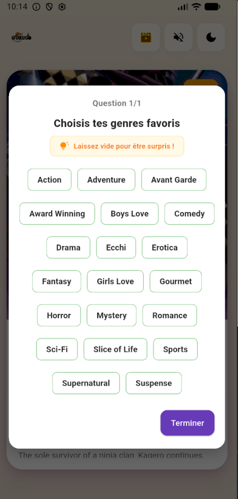
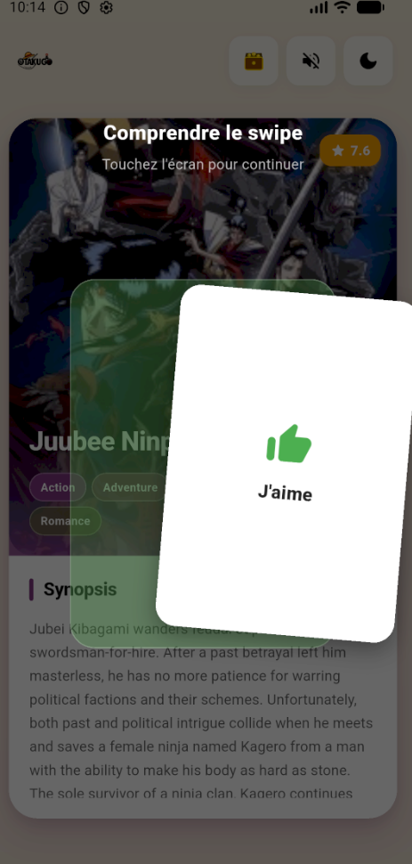
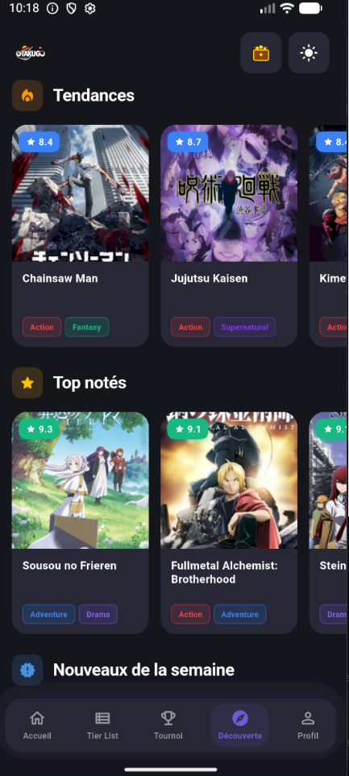
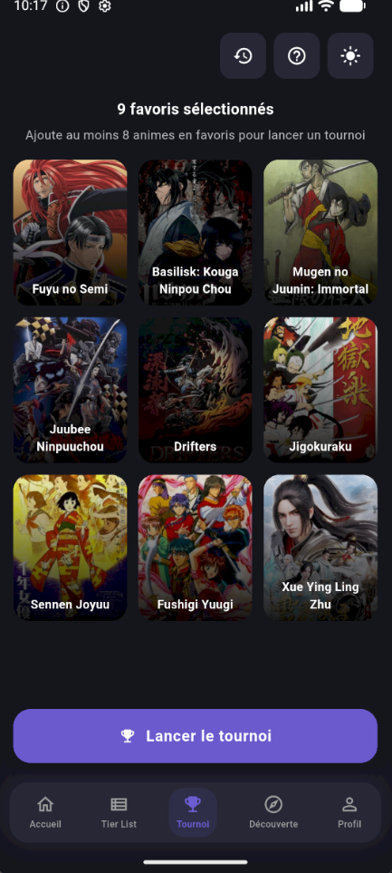
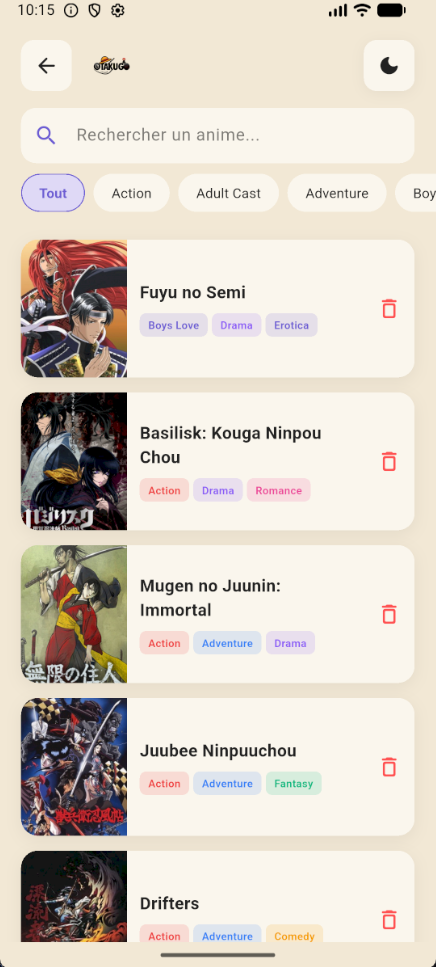
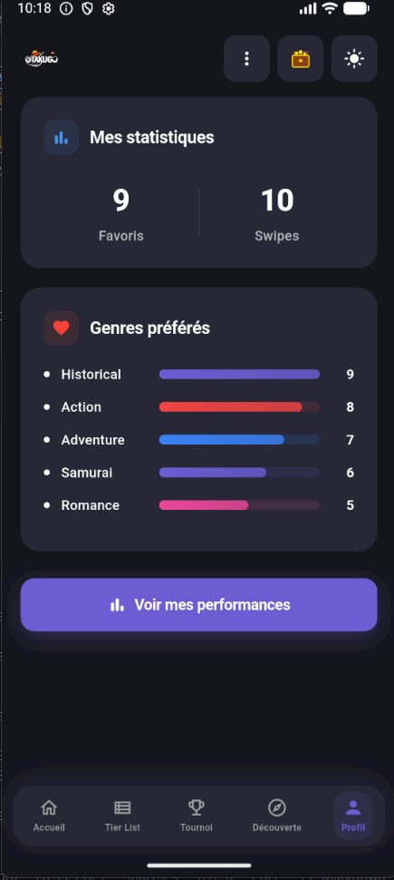

# 📱 **OtakuGo – Application Mobile de Recommandation d’Animes**

Projet réalisé dans le cadre du BUT Informatique – IUT de Villetaneuse

---

##  **Équipe du projet**

Ce projet a été construit par une équipe de 5 membres :

* **Manel Belaidouni**
* **Oumaima El Khadraoui**
* **Diarra Konté**
* **Séraphin Eyala**
* **Johann Zidee**

---

##  **Objectif du projet**

L’objectif d’**OtakuGo** est de proposer une **application mobile indépendante (no backend)** capable de recommander dynamiquement des animes **en fonction des préférences de l’utilisateur**, sans nécessiter de connexion internet.

Le concept repose sur un fonctionnement **mobile-first**, entièrement **local**, garantissant :

* la **souveraineté des données** de l’utilisateur,
* une utilisation hors ligne après chargement initial,
* des recommandations basées sur les **choix successifs** de l’utilisateur.

---

##  **Fonctionnalités principales**

L'application s'articule autour de 5 modules principaux :

### 1. Swipe
Système de swipe (inspiré de Tinder) pour découvrir des animes.

### 2. Algorithme évolutif
* **Filtrage :** Quiz dès le début pour cibler les genres préférés pour une recommendation personnalisée.
* **Recommandation hybride :** 80% des choix de l'utilisateur et 20% de découverte.

### 3. Coffre (Favoris)
Liste complète des animes "likés" avec accès aux fiches détaillées.

### 4. Tier List & Classement
Interface de **Drag & Drop** pour organiser ses animes favoris par rang (S, A, B, C, D, Z). Les nouveaux likes arrivent dans une zone tampon "À classer".

### 5. Mode Tournoi
Génération de duels entre les animes favoris pour déterminer le "Champion" de l'utilisateur.

### 6. Dashboard (Stats)
Visualisation des données utilisateur :
* Répartition des genres préférés (Shonen, Seinen, etc.).
* Statistiques d'utilisation (ratio de likes/dislikes).

---

##  **Technologies utilisées**
| Technologies | Usage dans le projet |
| :--- | :--- |
| **Flutter & Dart** | Développement cross-platform. |
| **Provider** | Gestion d'état (State Management) pour centraliser les données. |
| **Shared Preferences** | Persistance des données (sauvegarde locale). |
| **Just Audio** | Gestion du player audio pour l'ambiance sonore. |
| **Assets JSON** | Base de données locale pour garantir le mode hors-ligne. |

---

##  **Installation et exécution**

### Prérequis
* **Flutter SDK** installé (version stable).
* Un émulateur Android/iOS ou un appareil physique connecté.

### 1️ Cloner le projet

```bash
git clone https://github.com/votre-repo/otakugo.git
cd otakugo
```
Cette commande télécharge tout le code source dans le dossier otakugo et vous place à l'intérieur.

### 2️ Installer les dépendances Flutter

```bash
flutter pub get
```
Cette commande permet de télécharger toutes les librairies nécessaires (listées dans pubspec.yaml) :

### 3️ Exécuter sur un appareil ou un émulateur Android

```bash
flutter run
```
Cette commande construit l'APK (Android) et l'installe. Le premier lancement peut prendre quelques minutes.

---

##  **Aperçu**

## 📸 Aperçu de l'application

**1. Prise en main et Découverte**

| Quiz (Début) | Tuto Accueil | Page Découverte |
|:---:|:---:|:---:|
|  |  |  |

**2. Fonctionnalités et Profil**

| Mode Tournoi | Coffre (Favoris) | Page Profil |
|:---:|:---:|:---:|
|  |  |  |


---

### 🎌 Prêt à découvrir votre prochain banger ?

> **Go trouver ton animé avec OtakuGo !**

Merci de l'intérêt porté à notre projet SAE. N'hésitez pas à cloner le repo et à tester l'application !